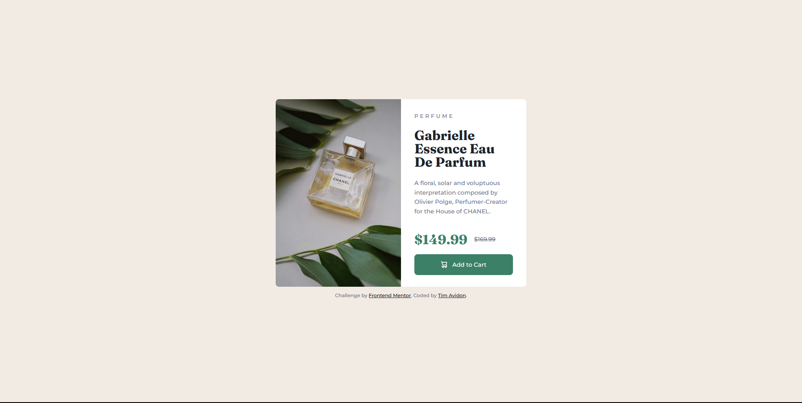

# Frontend Mentor - Product preview card component solution

This is a solution to the [Product preview card component challenge on Frontend Mentor](https://www.frontendmentor.io/challenges/product-preview-card-component-GO7UmttRfa). Frontend Mentor challenges help you improve your coding skills by building realistic projects. 

## Table of contents

- [Overview](#overview)
  - [Screenshot](#screenshot)
  - [Links](#links)
- [My process](#my-process)
  - [Built with](#built-with)
  - [Continued development](#continued-development)

## Overview

### Screenshot

### Links

- Solution URL: [Github](https://github.com/timavidon/frontend-mentor-c3)
- Live Site URL: [Live Site](https://timavidon.github.io/frontend-mentor-c3/)

## My process

### Built with

- HTML
- CSS
- Flexbox
- Resposive & Accessible
- Font 1: [Montserrat](https://fonts.google.com/specimen/Montserrat)
- Font 2: [Fraunces](https://fonts.google.com/specimen/Fraunces)

### Continued development

- Improve my responsive and accessabilty skills.
- Also write a better code for the reponsive part of this challenge.

